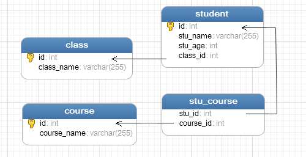

# 体检系统数据访问层：一个ORM持久化框架的设计与实现

## 摘要

## Abstract

## 引言

软件开发过程中，在程序中对数据库进行访问是十分普遍的行为。一个以数据为中心的软件系统，几乎处处都是数据库访问的代码。这些数据访问代码实现了软件系统的业务逻辑，形成了庞大的代码库，支撑起了信息化时代形形色色的信息系统。下面介绍几种常见的数据库访问方式。

### 传统数据库访问方式及其优劣

传统的数据库访问方式是指不通过中间层，直接对数据库进行操作的方式。Java中的JDBC和C#中的ADO.NET都是这种方式的典型代表。传统的数据库访问方式的典型步骤包括：加载数据库连接驱动，创建连接，创建数据库命令对象并为其赋予参数，执行命令并读取执行结果，关闭连接。

使用这种数据库访问方式的缺点是显而易见的，那就是充斥着大量冗余的模版代码。里面真正与我们的业务相关的只有一两句话，而我们却不得不为此写一大段模版性的代码来处理数据库连接的开启与关闭等操作。当我们只需要偶尔访问一次数据库的时候，时候这种方式也无可厚非，但是，随着业务的增长，访问数据库的次数也随之增加，系统中的冗余代码也会大量增长，这显然是不具有可维护性的。另外，这种方式还会使我们的代码与特定的数据库耦合在一起，因为不同的数据库会有不同的API，如果日后有更换数据库的需求，这种耦合必然也会造成维护上的困难。

当然，传统的数据库访问方式也并非一无是处。由于业务代码直接操作数据库，其中没有任何中间层，因此它较之其他的数据库访问方式，最大的优点是性能上的优势。然而，由于计算机硬件的发展，这点优势也变得微不足道，因此，除了少数对性能有严苛的要求的场景，极少有系统会采用这种数据库访问方式。

### 使用DbHelper工具类的方式

DbHelper工具类是位于业务逻辑代码与数据库访问代码之间的一个中间层，它采用模块化编程的思想，封装了传统数据库访问方式中的模板化代码，提供了一系列实用的函数以供调用。在使用时，只需要向其提供要执行的SQL语句及其参数即可。这种数据库访问方式避免了编写传统数据库访问方式中的大量冗余代码，同时得益于中间层相对简单，其性能也可与前者媲美。由于其方便使用，学习成本低，因此在体检系统开发的前期，我们曾大量使用了这种数据库访问方式。我们不仅可以使用自己开发的DbHelper工具类，还可以使用各种第三方的数据库访问工具，它们简单灵活，功能多样，因此有大量的信息系统采用这种方式。

然而，这种方式还是有一定的耦合度，我们的SQL是直接硬编码在代码中的，当数据库的结构发生改变时，我们就不得不修改遍布整个项目的SQL语句，这样极易导致错误。而且，不同数据库之间的SQL语法并不兼容，使用这种方式也无法消除代码与数据库之间的耦合。

### 使用ORM框架的意义

近些年来，面向对象的程序设计方法大行其道，我们希望能够在程序中将数据也作为对象来进行操作。然而，在数据库方面，虽然NoSQL数据库也开始兴起，但是主流的数据库仍然是关系型数据库，仍然使用SQL作为查询语言。为了解决关系型数据库的数据组织形式和面向对象的数据组织形式之间的根本性差异，ORM框架应运而生。ORM的全称是Object Relational Mapping，一般称作“对象-关系映射”，它将数据库中的表映射为编程语言中的类，将表中的字段映射为类中的属性，将外键关联映射为类中的嵌套对象，等等。

使用ORM框架，配置好对象-关系映射之后，我们就可以使用它提供的方法，方便地进行数据库操作。ORM框架会自动发起与关闭数据库连接，自动管理事务，自动将关系型的查询结果封装为对象。有些功能强大的ORM甚至还具有SQL自动生成，反向建库的功能（如Hibernate的反向工程，程序员可以先进行面向对象的建模，然后再由Hibernate自动创建数据表以及约束，程序员甚至完全不用关心具体的表结构，只需要关心领域模型的构建即可）。另外，ORM一般都会具有一套机制，可以避免在代码中直接嵌入SQL，以消除代码与SQL之间的耦合。ORM的出现，在工程上具有极其重大的意义，它能使我们对数据库的操作以自动化的方式进行，极大地提高了软件开发效率，也增强了软件系统的可维护性，程序员在一定程度上甚至成为了流水线上的“装配工人”。

在体检系统开发的后期，由于对自动化事务管理、防止SQL注入、查询结果自动封装等功能的强烈需求，我们不断修改数据访问层中的代码，也逐渐形成了一个自己的小型ORM框架。

## 背景

### 现有的主流ORM框架

如今C#平台上已有了各种各样的ORM框架，它们有着不同的理念与目标，因此功能也各有特点。下面简单介绍几种较为主流ORM。

 - NHibernate：NHibernate由Java平台下广为使用的开源ORM框架Hibernate移植而来，它是一个“重量级”的框架，对数据库结构提供了较为完整的封装，实现了实体类和数据表之间的映射。程序员只需要定义好映射关系，即可通过NHibernate提供的方法完成持久层操作。使用NHibernate，程序员不需要对SQL熟练掌握，甚至完全不需要写SQL，NHibernate会根据指定的存储逻辑，自动生成对应的SQL并调用ADO.NET加以执行。
 - MyBatis.NET:与NHibernate相比，MyBatis提供的是一种“半自动化”的ORM，它的着力点在于实体类与SQL（而不是数据表）之间的映射关系。使用MyBatis，程序员仍然需要在配置文件中手动写SQL，然后通过映射配置文件，将SQL所需的参数，以及返回的结果字段映射到指定的实体类。配置简单，可在SQL粒度上进行性能优化是其主要的优势。
 - Linq to SQL：C#在3.5版本中引入了Linq（Language-Integrated Query， 语言集成查询）的新特性，自此全面支持了函数式的编程方式。Linq to SQL将数据库中的数据视为C#语言中普通的集合，然后我们可以借助lambda表达式（即匿名函数）提供的便利对这些抽象出来的集合进行filter（即Where函数）、map（即Select函数）等经典的函数式操作。最终，一系列链式操作会形成一个Linq表达式，Linq to SQL解析这个表达式，生成合适的SQL送到数据库中执行。其最大的优点在于程序员可使用函数式的编程方式写出极为精简的数据库访问代码，然而缺点也很明显，那就是只支持SQL Server一种数据库。为了弥补这个缺点，微软已推出了Linq to SQL的替代者Entity Framework，它将Linq to SQL的理念进一步发扬光大，同时修复了种种缺点，包括多数据库的支持。

### ORM框架应实现的功能

通过分析现有的各种ORM框架，我们总结出一些功能清单，一个完整的ORM框架通常都会实现它们。我们体检系统的数据访问层也不完全实现了下面的一些特性。

 - 对象关系映射。这是一个ORM必须要具有的基本功能，无论是将实体类映射到数据表还是映射到SQL，ORM框架都必须提供一种机制，用以自动将关系型查询结果封装为对象，或者将对象保存为数据库中的关系型数据。
 - 消除程序代码与SQL的耦合。具体来说，就是尽量避免在代码中直接编写SQL命令。对于这个，不同的ORM有着不同的思想，NHibernate等传统的ORM的解决方式是由框架来生成SQL，避免程序员亲自编写。而MyBatis的实现方式是将SQL配置化，把SQL编写在配置文件中，从而将其从程序代码中分离出来。
 - 多数据库支持。一个完整的ORM应该具有多数据库的支持，以消除程序代码与具体数据库的耦合，在不同的数据库之间切换时，只需更改配置文件即可，不需修改程序代码。具有SQL生成机制的ORM，在支持多数据库的时候，还应该针对当前使用的具体数据库来优化生成的SQL，以充分发挥不同数据库的优势。
 - 数据库连接与事务的自动化管理。一个ORM必须将程序员从创建与关闭数据库连接等模版性代码中解脱出来，使他们专注于业务逻辑，同时还要提供一个事务管理的机制，用以将多个操作组合成事务。出于性能考虑，ORM还可以提供连接池机制。
 - 设计良好的查询API。一套设计良好、使用方便的查询API可以大大减轻程序员的工作量。NHibernate就为此专门设计了一门查询语言HQL，它借鉴了SQL的语法，却是一门面向对象的查询语言，极大地方便了查询代码的编写。另外，DSL（Domain Specific Language，领域专用语言）也是设计查询API的一种思路，前文提到的Linq也就是一种DSL。
 - 缓存机制。许多人不愿意使用ORM的主要原因是较高层次的封装可能会使查询成为性能的瓶颈。为了优化性能，许多ORM都会提供一个缓存机制，用以缓存查询的结果，当同样的SQL再次执行的时候，ORM可能不会再去访问数据库，而改为从缓存中直接获取。当然，可缓存的内容不仅仅是数据，一些对实时性要求不高的操作也可以缓存下来，积累到下次数据库连接发起时再批量执行，以此降低连接发起的频率。
 - 懒加载机制。当我们从数据库取得一个对象时，我们可能并不需要这个对象的所有信息，这时如果还将它们查询出来是一种对性能的浪费，特别是对象中还具有嵌套对象（对应数据库中的外键关系）的情况下，ORM可能还需要生成一个连接查询将嵌套对象的信息一并取出。懒加载就是在取得这个对象的时候，只查询它的一些基本信息，不查询与之关联的其他表以及某些大字段，只有在程序中使用到这些信息的时候，才从数据库中查询。而这一切对于程序员是透明的，程序员只需假设对象中具有他需要的所有信息，不必关心它们是如何查询出来的。

### 技术背景及理论依据

为了实现上述功能，我们需要使用到不同的技术，下面列举一些我们使用到的技术。

 - 反射。反射是指计算机程序在运行时可以访问、检测和修改它本身状态或行为的一种能力。在这里，我们使用到反射的地方主要是读取配置在实体类中的元数据以构建对象和数据表之间的映射信息，以及利用这些映射信息进行对象和关系型数据之间的自动转换。另外，为了解除程序代码与特定数据库的耦合，我们将具体的数据库操作类进行配置化，这时就不能通过常规的方式来创建对象，只能使用反射。总之，反射作为框架构建的基本技术，在一个ORM中几乎处处都有它的身影。
 - 面向接口编程。在C#中，接口是一个包含了方法声明但是没有方法实现的特殊的类，它是一组规则的集合，它规定了实现本接口的类必须拥有的一组规则。我们这里把面向接口编程的思想主要应用在实现多数据库的支持上，根据这种思想，我们访问数据库的底层模块并不是直接向其上层提供服务，而是通过定义一组接口，仅向上层暴露其接口功能，上层对于下层仅仅是接口依赖，而不依赖具体的类。这样做使得系统具有很大的灵活性及扩展性，我们能够随时替换底层的实现，而接口保持不变，体现在我们的框架中，在更换数据库时，只需要更改一下配置文件即可。
 - Linq表达式解析与SQL语法树。微软还为Linq提供了表达式树支持，一条Linq表达式会被表示为一个树形的数据结构，第三方开发者在使用Linq作为其DSL时，直接解析这颗表达式数转换成自己需要的目标语言即可，不需要再进行词法分析和语法分析。在这里，我们使用Linq作为自己的查询API，通过解析Linq表达式树来生成SQL。另外，为了编码的方便，我们将SQL也抽象为一个树形结构，在解析Linq表达式树时，并不直接生成SQL字符串，而是生成一颗SQL表达式树，最后在将这颗表达式树翻译为SQL文本。
 - 动态代理。有时候我们希望拦截某些方法的执行，在这些方法执行之前或之后加入一些特定的处理，比如打印日志或者加入缓存机制等等，这就是所谓AOP（Aspect Oriented Programming，面向切面编程）的思想。使用代理模式可以很方便地实现这一点，比如提供一个被代理类的子类，这个子类重写了父类的所有方法，在里面添加自己的操作，然后再调用父类的方法。这就是利用继承实现的静态代理模式，静态代理模式的缺点在于，对于每一个被代理类，我们都要为其编写一个代理子类。因此，在需要批量对一些类进行统一的代理的时候，就需要使用到动态代理的技术，我们可以使用Emit在运行时动态创建被代理类的子类，在这个动态创建出来的子类中动态添加代理逻辑，也可以使用第三方动态代理类库，提供一个拦截器对象作为拦截的时候执行的操作。在这里我们使用动态代理主要是为了实现懒加载机制，通过拦截属性的访问，我们就能得知数据被访问的时机，做到延迟查询数据库。

## 总体功能设计

### 框架基本配置

使用本框架，首先要将它编译生成的dll文件复制到使用该它的项目中，然后添加对该dll的引用。如果项目使用到的数据库需要依赖其他dll，还需添加这些dll的引用，例如使用MySQL数据库，需要添加MySql.Data.dll。最后，添加一个ini配置文件，配置框架所需的基本信息。

默认的配置文件应位于程序的启动目录，文件名为FrameDAL.ini，也可以在AppContext第一次被调用之前通过Configuration.DefaultPath设置配置文件的路径。下面是一个配置文件的范例：

````ini
	[Settings]
	EnableLazy=true
	EnableCascade=true
	LogFile=FrameDAL.log
	LogAppend=true
	DbHelperAssembly=FrameDAL.dll
	DbHelperClass=FrameDAL.DbHelper.MySqlHelper
	
	[ConnStr]
	server=localhost
	database=test
	user id=root
	password=root
	charset=utf8
````

配置文件主要分为两个节点，一个是Settings，用于配置框架运行所需的基本信息，第二个是ConnStr，用于配置数据库连接字符串。Settings节点下还有许多不同的配置项，下面是它们的具体功能：

 - EnableLazy：启用懒加载的总开关，查询时关联的属性会以此作为默认配置，选择是否启用懒加载。
 - EnableCascade：是否启用级联操作，若启用，对一个对象进行增删改等操作会影响到与其关联的其他对象。
 - LogFile：日志输出目录，框架的运行日志将会输出到此文件，设置为空则不启用日志。
 - LogAppend：日志输出模式，false则每次运行都会都会清空日志文件再输出，true则在原文件末尾添加新日志。
 - DbHelperAssembly：实现了IDbHelper接口的类所在的类库的dll文件名称，不同的数据库具有不同的DbHelper，本框架内置了MySQL、Oracle等常用数据库的DbHelper，也可以使用第三方的扩展，此时这项配置就是第三方DbHelper所在的类库的dll文件名。
 - DbHelperClass：DbHelper类的命名空间限定类名。

ConnStr是数据库连接串的配置项，具体的内容依所使用的数据库不同而定。下面是MySQL中一些配置项的含义：

 - server：数据库服务器的地址。
 - database：数据库名
 - user id：数据库用户名
 - password：数据库密码

### 对象-关系映射配置

作为一个ORM框架，最重要的部分就是“映射”，如何优雅地实现对象与关系数据的映射是ORM框架永恒的主题。现有的主流ORM框架通常都会提供两种配置映射的方式，一种是XML方式，另一种是Attribute元数据标记（在Java中称为Annotation）的方式。本框架支持的是第二种，即直接在实体类上添加Attribute元数据标记来描述它和数据表之间的映射关系。下面以一个简单的业务模型为例，介绍本框架的映射方式设计。

在此例中，具有班级、学生和课程三个实体。班级和学生是一对多的关系，一个班级可以有多个学生，但每个学生只能属于一个班级。体现在表的结构上，student表中具有一个class_id的外键字段，引用了class表的主键。学生和课程是多对多的关系，一个学生可以修多门课程，一门课程也能有多个学生。多对多的关系需要额外使用一张关联表stu_course来表示，这张关联表中只有两个外键字段，分别引用了student表和course表的主键。具体的表结构如下图所示。



现在，我们对这个业务场景进行面向对象的建模，我们分别用Class、Student和Course三个类来表示这三个实体。其中，Class类中应该具有一个Student对象的集合，以表示该班级中的所有学生，Student类中应该具有一个Class类的嵌套对象，以表示该学生所属的班级。另外Student类中还应具有一个Course对象的集合，表示该学生选修的所有课程，同理，Course类中也应该有一个Student对象的集合。将上面的分析转换成C#代码如下。

````C#
	[Table("class")]
    public class Class
    {
        [Id(GeneratorType.Identity)]
        [Column("id")]
        public virtual int Id { get; set; }

        [Column("class_name")]
        public virtual string ClassName { get; set; }

        [OneToMany("class_id")]
        public virtual List<Student> Students { get; set; }
    }

    [Table("student")]
    public class Student
    {
        [Id(GeneratorType.Sequence, SeqName = "student_sequence")]
        [Column("id")]
        public virtual int Id { get; set; }

        [Column("stu_name")]
        public virtual string StuName { get; set; }

        [Column("stu_age")]
        public virtual int StuAge { get; set; }

        [ManyToOne("class_id", LazyLoad = false)]
        public virtual Class Class { get; set; }

        [ManyToMany(JoinTable = "stu_course", JoinColumn = "stu_id", InverseJoinColumn = "course_id")]
        public virtual List<Course> Courses { get; set; }
    }

    [Table("course")]
    public class Course
    {
        [Id(GeneratorType.Identity)]
        [Column("id")]
        public virtual int Id { get; set; }

        [Column("course_name")]
        public virtual string CourseName { get; set; }

        [ManyToMany(JoinTable = "stu_course", JoinColumn = "course_id", InverseJoinColumn = "stu_id")]
        public virtual List<Student> Students { get; set; }
    }
````

上面的代码与普通的C#类并没有太大的区别，唯一的不同在于这些类使用了大量Attribute元数据标记，这些元数据描述了这些类与数据表之间的映射关系。另外，这些Attribute中还具有一些额外的配置项，这些配置项将对框架的运行方式有不同的影响。

下面是各种Attribute的功能说明：

 - Table：TableAttribute用于修饰类，表示这个实体类对应数据库中的一张表或者视图，它接受一个字符串参数作为表名，此参数将用于构造查询的SQL语句。
 - Id：IdAttribute必须与ColumnAttribute一起使用，表示它修饰的属性对应于表中的主键字段。它具有两个参数，GeneratorType参数接受一个枚举值，表示一个特定的主键生成策略，可用值包括Assign（手动赋值）、Uuid（全局唯一ID）、Identity（自增长）和Sequence（序列）。SeqName接受一个字符串，当GeneratorType配置为Sequence时可用，用于指定数据库中用于生成主键的序列名。
 - Column：ColumnAttribute用于修饰属性，表示这个属性对应表或视图中的一个字段。它具有三个参数，Name为字段名，ReadOnly表示此属性是否只读，当设置为只读时，对这个属性作出的修改将无法持久化到数据库，LazyLoad是开启懒加载的开关，对于普通属性，其默认值为false。
 - ManyToOne：ManyToOneAttribute修饰嵌套对象属性，用于表示数据库中的多对一关系。它具有三个参数，ForeignKey表示对应的外键字段的名称，LazyLoad是懒加载的开关，对于关联属性，其默认值为true，Cascade表示级联操作的类型，用于配置对此实体类的修改同步更新到该关联属性的时机。
 - OneToMany：OneToManyAttribute修饰嵌套对象属性，用于表示数据库中的一对多关系。它具有三个参数，InverseForeignKey表示外键字段的名称，LazyLoad是懒加载的开关，Cascade表示级联操作的类型。
 - ManyToMany：ManyToManyAttribute修饰嵌套对象属性，用于表示数据库中的多对多关系。它具有五个参数，JoinTable表示关联表的表名，JoinColumn表示指向本表主键的外键名，InverseJoinColumn表示指向另一端的表的主键的外键名，LazyLoad是懒加载的开关，Cascade是级联操作的类型。

配置映射关系是使用ORM框架的第一个步骤，这种使用Attribute元数据标记作为映射方式的设计简单便捷，学习成本低。配置好映射关系之后，就可以使用框架提供的API方便地进行数据持久化操作了。

### 核心API与增删改操作

AppContext类是使用框架的功能的入口，由于使用了单例模式，因此在整个程序的生命周期，只有一个此类的实例，即全局上下文对象。它的功能主要是读取框架配置信息创建Configuration对象，读取并缓存配置在Attribute元数据标记中的映射信息，以及提供一些便捷的工具方法。作为创建Session对象的工厂，它还具有会话管理的功能。此外，AppContext对象还保存了一个DbHelper对象的实例，我们可以使用它方便地进行比较底层的数据库操作。

Session抽象出了数据库会话的概念，它代表一个完整的业务操作。Session具有连接管理的功能，在一个会话中，可以有一次或多次数据库操作，会话会根据需要自行打开或关闭连接。另外，会话还具有一个操作缓存，可将多个数据库操作缓存起来，等到合适的时间再批量执行，以降低建立数据库连接的频率。

Session对象可通过AppContext对象获得，获得Session对象之后，我们就可以使用它提供的方法，对实体进行各种CURD操作。下面是往数据库中保存一个学生对象的例子：

````C#
	AppContext context = AppContext.Instance;
    using (ISession session = context.OpenSession())
    {
        Student student = new Student();
        student.StuName = "Vincent";
        student.StuAge = 20;
        student.Class = new Class { ClassName = "信息工程" };
        student.Courses = new List<Course>();
        student.Courses.Add(new Course() { CourseName = "数据库原理" });
		
        session.Add(student);
    }
````

上面的代码首先获得了全局上下文对象，通过这个对象打开了一个数据库会话，然后创建了一个Student实体对象，并且给这个对象填充了各种信息，包括与之关联的Class对象与Course集合的信息，最后调用Add方法将该实体保存到数据库。代码执行的结果是在class表和course表中分别插入关联的数据，在再student表中插入该实体的数据，其中class_id外键字段保存了刚刚在class表中插入的数据的主键，最后再在stu_course关联表中插入student与course之间的关联。如此复杂的多表插入操作，得益于框架的帮助，只需要调用一个Add方法，即可自动完成。

修改一个实体类的信息也十分简单：

````C#
	Student student = session.Get<Student>(23);
    student.StuAge = 21;
    student.Courses.Clear();
    session.Update(student);
````

上面的代码先通过Get方法从数据库中取出了Id为23的学生，然后将该学生的年龄修改为21岁，清除他选修的所有课程，再调用Update方法将所作的改动保存到数据库。代码执行的结果是student表中该条记录的stu_age字段被修改为21，关联表stu_course中所有与该学生对应的关联信息都被清除，但是course表中的记录还会保留，因为可能也有其他学生选修了这些课程。

删除一个实体的代码也是只需调用一个Delete方法即可：

````C#
	Student student = session.Get<Student>(23);
    session.Delete(student);
````

上面的代码不仅删除了student表中的这条记录，还会同时清除关联表stu_course中的记录，避免数据库中残留无用数据。

### 事务控制

在一个Session中进行多次操作默认是不具备事务性的，如果在操作期间发生了异常，那么已经完成的操作将无法回滚。因此，当我们的某些业务逻辑对事务性有要求时，就需要我们手动进行事务控制，Session中具有事务控制相关的API，下面是它们的使用范例：

````C#
	try
    {
        session.BeginTransaction();
        // ACID operations...
        session.CommitTransaction();
    }
    catch
    {
        session.RollbackTransaction();
        throw;
    }
````

这里使用了一个try-catch语句块，我们首先调用BeginTransaction方法开启事务，再进行具体的业务操作，最后调用CommitTransaction方法提交事务，若其中发生了异常，则跳转到catch语句中，在里面进行RollbackTransaction回滚事务，并且用throw语句将异常抛出，使外界得知异常的发生。把我们的业务代码用上述语句包裹起来，就可拥有事务的ACID特性，即原子性（atomicity）、一致性（consistency）、隔离性（isolation）和持久性（durability）。

Session把事务控制从数据访问层提升到了业务逻辑层，使程序员不需要管理数据库连接就可进行事务控制，但即便如此，显式的事务控制代码还是太模板化，显得有点冗余。因此，AppContext类提供了DoTransactional方法，调用这个方法，传入一个委托作为参数，这个委托中的代码就会在事务中执行。配合C# 3.0新增的lambda表达式的特性，事务控制的代码就能变得十分简洁。

````C#
	context.DoTransactional(session => {
        // ACID operations...
    });
````

### LINQ查询

查询是发生最频繁的数据库操作，本框架使用Linq作为标准查询API，因此适用于Linq的写法，大部分都可用于本框架中的数据库查询。要使用Linq查询，首先要获得一个IQueryable对象，Session中的GetAll方法就是获得一个默认的IQueryable对象的方法，它表示返回指定实体类所有对象的默认查询。我们可以在这个默认的查询上调用Where方法，传入一个lambda表达式作为谓词，就得到一个具有指定的筛选条件的查询，比如：

````C#
	var query = session.GetAll<Student>().Where(s => s.StuName == "Vincent");
````

上面的查询返回所有名字为Vincent的Student对象。我们还可以在新的查询对象上继续调用Where方法进一步地筛选结果，或者调用Select方法对结果作投影操作，最终会形成一连串的链式方法调用，如：

````C#
	var query = session.GetAll<Student>()
        .Where(s => s.StuName == "Vincent")
        .Where(s => s.StuAge > 18)
        .Select(s => new { s.StuName, s.StuAge });
````

上面的查询将返回所有名字为Vincent并且年龄大于18的学生的名字和年龄。C#还提供了一系列关键字，用于简化这种链式方法调用的编写，下面的查询与上面的链式调用是等效的。

````C#
	var query = from s in session.GetAll<Student>()
                where s.StuName == "Vincent"
                where s.StuAge > 18
                select new { s.StuName, s.StuAge };
````

可以看到，Linq与SQL在语法上具有一定的相似性，这对于熟悉SQL的程序员来说，只需略加学习就可上手使用。另外，本框架还支持了Linq中的连接查询、排序、分页等操作，这样，把各种操作组合在一起，就能实现一些比较复杂的查询，如：

````C#
	var query = session.GetAll<Student>()
	    .Where(s => s.StuAge > 18 && s.StuAge < 20)
	    .OrderBy(s => s.StuAge)
	    .ThenBy(s => s.Id)
	    .Skip(2)
	    .Take(2);
````

使用Linq查询，不仅可以避免直接在代码中编写SQL，而且受益于编译期检查，写出类型安全的查询也会比较容易。

### SQL查询

无论Linq有多么方便，它始终无法完全代替SQL。因为由程序生成的的SQL对DBA十分不友好，难以进行优化，在一些特殊的场景中，还是有在SQL粒度上进行性能优化的需求，但又不希望失去ORM带来的便利性。这也是Hibernate早期希望HQL作为面向对象的查询语言，能够完全取代SQL的使用，但后来又不得不提供SQL查询相关的API的原因。

使用SQL查询，首先要通过Session的CreateSQLQuery方法创建一个SQL查询对象，然后指定SQL语句以及查询参数，最后调用ExecuteGetEntity或ExecuteGetList方法，指定类型参数，就可以执行查询，并且将查询结果直接转化为对象。

````C#
	ISqlQuery query = session.CreateSqlQuery();
    query.SqlText = "select * from student where stu_name=?";
    query.Parameters = new object[] { "Vincent" };

    List<Student> students = query.ExecuteGetList<Student>();
    Shell.WriteLine(student.Courses.Count.ToString());
````

上面的查询从数据库中取出姓名为Vincent的Student对象。懒加载在使用SQL查询的时候也能起到作用，上面的SQL命令中并没有显式查询出任何与课程有关的信息，但是student.Courses这句话却能够取出该学生选修的所有课程，这是懒加载机制在后台起作用，在调用student.Courses时，框架会通过该学生的ID从course表中查询出需要的数据。但是，这一切对程序员都是自动化而且透明的，程序员不需要做任何额外的操作。

不同的数据库对于分页的处理是不同的，如MySQL使用limit子句，而Oracle是通过rownum进行分页。SqlQuery对这种情况也提供了一定的支持，只需要设置query对象的FirstResult以及PageSize属性的值，框架即可为你拼接好分页查询的SQL。

````C#
	ISqlQuery query = session.CreateSqlQuery("select * from student where stu_age>?", 18);
    query.FirstResult = 10;
    query.PageSize = 10;
    List<Student> students = query.ExecuteGetList<Student>();
````

有时候我们需要把查询结果封装到一个临时的类中，而这个类并没有配置Attribute元数据，因为你只打算使用它来临时保存数据，并不作为实体类使用。这时，使用SqlQuery中提供的ResultMap，在里面指定属性与SQL返回的字段的映射关系，就可以方便地完成结果封装，如：

````C#
	class StudentInfo
    {
        public string Name { get; set; }
        public int Age { get; set; }
    }

    public void TestResultMap()
    {
        ISqlQuery query = session.CreateSqlQuery("select stu_name, stu_age from student");
        query.ResultMap = new Dictionary<string, string>();
        query.ResultMap["Name"] = "stu_name";
        query.ResultMap["Age"] = "stu_age";
        List<StudentInfo> students = query.ExecuteGetList<StudentInfo>();
    }
````

## 主要技术难点与实现方式

### 数据库无关性的实现

### 懒加载的实现

### 缓存的实现

### 对反射的性能改进

## 成果

### 对编程方式的影响

### 对性能的影响

## 参考文献

## 附录